# 🏨 Hotel Management, Travel & Hospitality Platform

> A full-service hospitality management platform combining **Hotel Management, Travel & Tourism, Restaurant, Bar, Transportation, Spa, Massage, Wellness, Dynamic Packages, Real-Time Booking, Payments, Rescheduling and Customer Experience Management**.

---

## 📌 Project Overview

This project is a **single-hotel, full-service hospitality management system** designed to manage the complete customer journey — from discovering a hotel and building a personalized travel package to booking, payment, check-in, activities, dining, wellness, rescheduling, cancellation, refunds and repeat bookings.

The platform consists of two primary applications:

```text
┌─────────────────────────────────────────────────────────────┐
│                    HOSPITALITY PLATFORM                     │
├──────────────────────────────┬──────────────────────────────┤
│        CUSTOMER PORTAL       │        ADMIN PORTAL          │
│                              │                              │
│ • Hotel Booking              │ • Hotel Management           │
│ • Travel & Tours             │ • Restaurant Management      │
│ • Restaurant                 │ • Bar Management             │
│ • Bar                        │ • Tour Management            │
│ • Transportation             │ • Transportation             │
│ • Spa & Massage              │ • Spa & Wellness             │
│ • Package Builder            │ • Package Builder            │
│ • Payments                   │ • Pricing Engine             │
│ • My Trips                   │ • Booking Management         │
│ • Reschedule                 │ • Payments & Refunds         │
│ • Cancellation               │ • Reports                    │
│ • Book Again                 │ • Staff & Permissions        │
└──────────────────────────────┴──────────────────────────────┘
```

---

# 🎯 Project Goals

The system is designed around five major goals:

1. **Unified Hospitality Management**
2. **Dynamic Package & Pricing Management**
3. **Real-Time Availability and Booking**
4. **Flexible Rescheduling, Cancellation and Refunds**
5. **Complete Customer Travel History and Rebooking**

---

# 🧩 Major Modules

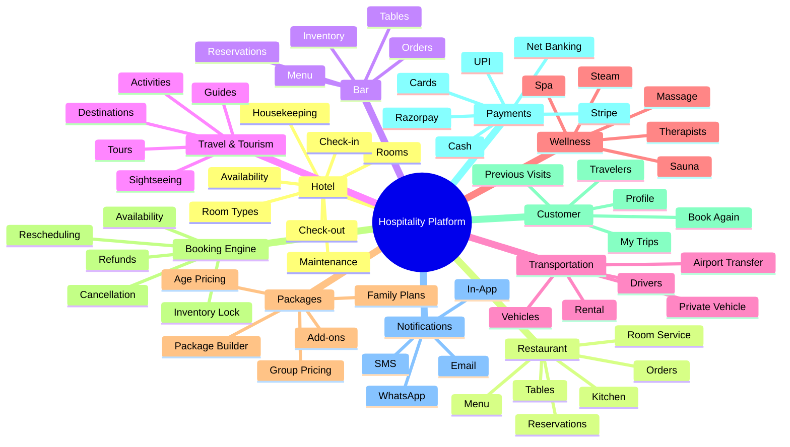

---

# 🛠️ Technology Stack

## Frontend

| Technology            | Purpose                         |
| --------------------- | ------------------------------- |
| Next.js               | Frontend framework / App Router |
| React                 | UI framework                    |
| Axios                 | API communication               |
| Zustand / Context API | State management                |
| CSS / CSS Modules     | Styling                         |

## Backend

| Technology            | Purpose                     |
| --------------------- | --------------------------- |
| Python                | Backend language            |
| Django                | Backend framework           |
| Django REST Framework | REST API                    |
| JWT                   | Authentication              |
| Django Channels       | WebSockets                  |
| Celery                | Background jobs             |
| Redis                 | Caching and inventory locks |
| drf-spectacular       | OpenAPI / Swagger           |

## Database

| Technology      | Purpose              |
| --------------- | -------------------- |
| MariaDB / MySQL | Relational database  |
| Django ORM      | Database abstraction |

## Payment

The architecture supports multiple payment providers:

- Razorpay
- Stripe
- UPI
- Cards
- Net Banking
- Wallets
- Cash
- Pay at Hotel
- Bank Transfer

The payment architecture must remain **gateway-independent**.

---

# 🏗️ High-Level Architecture

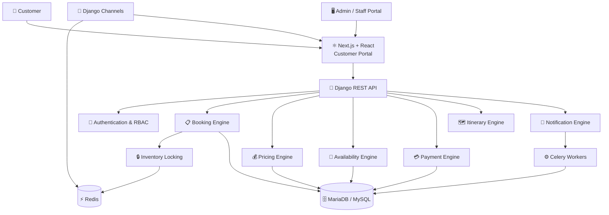

---

# 🧱 Backend Architecture

The backend should use a modular Django architecture.

```text
backend/
│
├── config/
│   ├── settings/
│   ├── urls.py
│   ├── asgi.py
│   ├── wsgi.py
│   └── celery.py
│
├── apps/
│   │
│   ├── accounts/
│   ├── hotels/
│   ├── rooms/
│   ├── restaurants/
│   ├── bar/
│   ├── tours/
│   ├── transportation/
│   ├── wellness/
│   ├── packages/
│   ├── bookings/
│   ├── pricing/
│   ├── payments/
│   ├── inventory/
│   ├── notifications/
│   ├── reviews/
│   ├── reports/
│   ├── coupons/
│   └── audit/
│
├── common/
│   ├── exceptions/
│   ├── permissions/
│   ├── pagination/
│   ├── validators/
│   ├── utilities/
│   └── responses/
│
├── manage.py
└── requirements.txt
```

---

# ⚛️ Frontend Architecture

```text
frontend/
│
├── src/
│   │
│   ├── components/
│   │   ├── common/
│   │   ├── layout/
│   │   ├── forms/
│   │   ├── booking/
│   │   ├── hotel/
│   │   ├── restaurant/
│   │   ├── bar/
│   │   ├── tours/
│   │   ├── transport/
│   │   ├── wellness/
│   │   ├── packages/
│   │   ├── payments/
│   │   └── admin/
│   │
│   ├── pages/
│   │
│   ├── features/
│   │
│   ├── services/
│   │
│   ├── stores/
│   │
│   ├── hooks/
│   │
│   ├── utils/
│   │
│   ├── routes/
│   │
│   └── styles/
│
├── package.json
└── vite.config.js
```

---

# 👥 User Roles

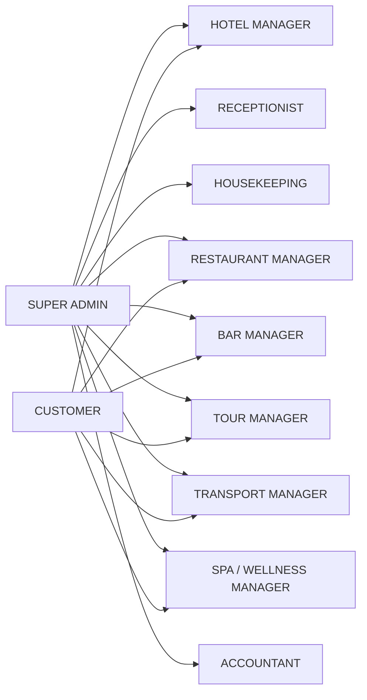

---

# 🔐 Role-Based Access Control

Permissions should be granular.

Examples:

```text
booking.view
booking.create
booking.update
booking.cancel
booking.reschedule

room.view
room.manage
room.block
room.checkin
room.checkout

restaurant.manage
restaurant.booking.manage

bar.manage
bar.booking.manage

tour.manage
tour.booking.manage

transport.manage

wellness.manage

payment.view
payment.refund

report.view

user.manage
settings.manage
```

Backend permissions are authoritative.

Frontend route protection alone is **not sufficient**.

---

# 🏨 Hotel Management

## Room Types

Each room type can contain:

```text
Name
Description
Capacity
Adult Capacity
Child Capacity
Bed Type
Number of Beds
Base Price
Weekend Price
Seasonal Price
Amenities
Images
Status
```

## Individual Rooms

```text
Room Number
Room Type
Floor
Status
Housekeeping Status
Maintenance Status
```

### Room Status

```text
AVAILABLE
OCCUPIED
RESERVED
CLEANING
MAINTENANCE
BLOCKED
OUT_OF_SERVICE
```

---

# 🍽️ Restaurant Management

Features:

- Table management
- Table availability
- Menu categories
- Menu items
- Pricing
- Tax
- Reservations
- Orders
- Kitchen workflow
- Room service
- Takeaway

### Restaurant Order Lifecycle

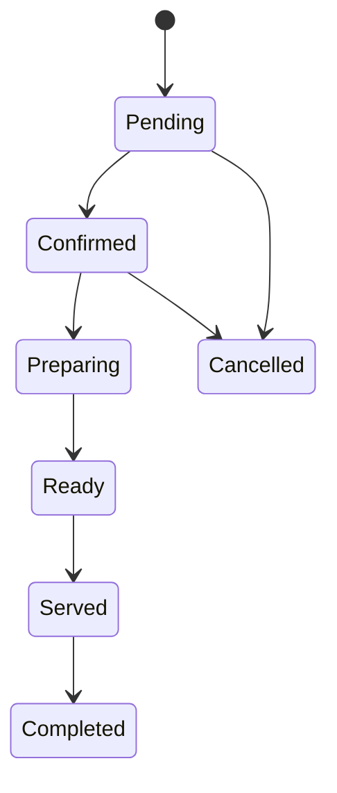

---

# 🍸 Bar Management

Features:

- Bar tables
- Reservations
- Bar menu
- Categories
- Orders
- Pricing
- Taxes
- Inventory
- Availability

Alcohol-related compliance rules should remain configurable according to the applicable jurisdiction.

---

# 🗺️ Travel & Tourism

Support:

- Destinations
- Sightseeing
- Guided tours
- Adventure activities
- Cultural experiences
- Local experiences
- Activity schedules
- Tour guides
- Capacity management

Each activity supports:

```text
Name
Description
Location
Duration
Capacity
Adult Price
Teen Price
Child Price
Infant Price
Start Time
End Time
Available Days
Guide
Images
Status
```

---

# 🚗 Transportation

Supported services:

```text
Airport Transfer
Taxi
Private Vehicle
Bus
Rental Vehicle
Local Commute
Tour Vehicle
```

Vehicles:

```text
Vehicle Number
Vehicle Type
Capacity
Driver
Base Price
Per KM Price
Availability
Status
```

Vehicle upgrades:

```text
Standard
Premium
Luxury
Private
```

---

# 🧖 Wellness & Spa

Supported services:

```text
Spa
Massage
Facial
Sauna
Steam
Body Treatment
Beauty Treatment
Wellness Package
```

Each service:

```text
Name
Category
Description
Duration
Price
Tax
Capacity
Staff Required
Location
Availability
```

Therapists:

```text
Name
Specialization
Working Hours
Availability
Status
```

---

# 📦 Dynamic Package Builder

Packages can combine multiple services.

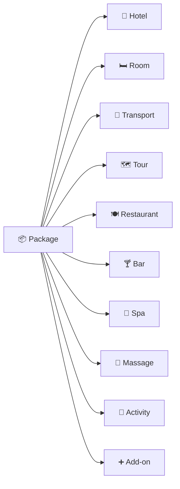

Example:

### 3 Night Premium Experience

```text
🏨 3 Night Deluxe Room

🚗 Airport Transfer

🗺️ City Sightseeing

🍳 Daily Breakfast

💆 60 Minute Massage

🚘 Optional Private Vehicle
```

---

# 👨‍👩‍👧‍👦 Family & Group Pricing

Support configurable plans.

Example:

```text
Family Plan
2 Adults + 2 Children
Fixed Price
```

Group discounts:

```text
1–2 People   → Standard
3–5 People   → Configurable Discount
6–10 People  → Configurable Discount
11–20 People → Configurable Discount
```

All values must be configurable by administrators.

---

# 👶 Age-Based Pricing

Supported categories:

```text
Adult
Teenager
Child
Infant
```

The admin can configure:

```text
Age From
Age To
Fixed Price
Percentage of Adult Price
```

Example:

```text
Adult     → 100%
Teenager  → 80%
Child     → 50%
Infant    → Free
```

These are example rules, not hard-coded business rules.

---

# 💰 Pricing Engine

The pricing engine is one of the core systems.

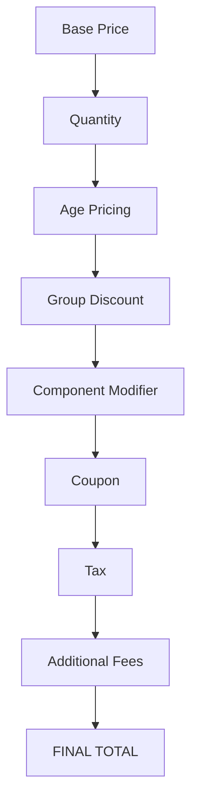

Conceptual formula:

```text
Final Total =
Base Price
+ Quantity Adjustments
+ Age Pricing
+ Component Upgrades
+ Additional Services
- Group Discount
- Coupon Discount
+ Taxes
+ Fees
```

The **backend is always the authoritative pricing source**.

---

# 👥 Headcount Planner

Customers can specify:

```text
Adults
Teenagers
Children
Infants
```

The system calculates:

```text
Room Allocation
Ticket Quantity
Transport Seats
Tour Capacity
Restaurant Seats
Wellness Participants
```

---

# 🧑‍🤝‍🧑 Individual Service Assignment

Services can be assigned to individual travelers.

Example:

```text
4 Travelers

Traveler 1 → Spa
Traveler 2 → None
Traveler 3 → Massage
Traveler 4 → None
```

This allows precise package customization.

---

# 🧙 Unified Booking Wizard

```mermaid
flowchart LR

    A["1. Destination"]
    B["2. Dates"]
    C["3. Guests"]
    D["4. Hotel"]
    E["5. Transport"]
    F["6. Tours"]
    G["7. Dining"]
    H["8. Bar"]
    I["9. Wellness"]
    J["10. Add-ons"]
    K["11. Review"]
    L["12. Payment"]
    M["13. Confirmation"]

    A --> B --> C --> D --> E --> F --> G --> H --> I --> J --> K --> L --> M
```

---

# 🛒 Live Combo Configurator

The customer can:

- Add services
- Remove services
- Upgrade services
- Change quantities
- Assign services to individual travelers
- View price changes immediately
- Receive recommendations

Example:

```text
Standard Vehicle
       ↓
Upgrade
       ↓
Luxury Private Vehicle
       ↓
+ ₹X
```

---

# 🧠 Smart Itinerary Engine

The system generates a chronological itinerary.

Example:

```text
DAY 1

10:00 AM
Airport Pickup

12:00 PM
Hotel Check-in

01:00 PM
Lunch

04:00 PM
City Tour

07:30 PM
Dinner

09:00 PM
Massage
```

---

# ⚠️ Conflict Detection

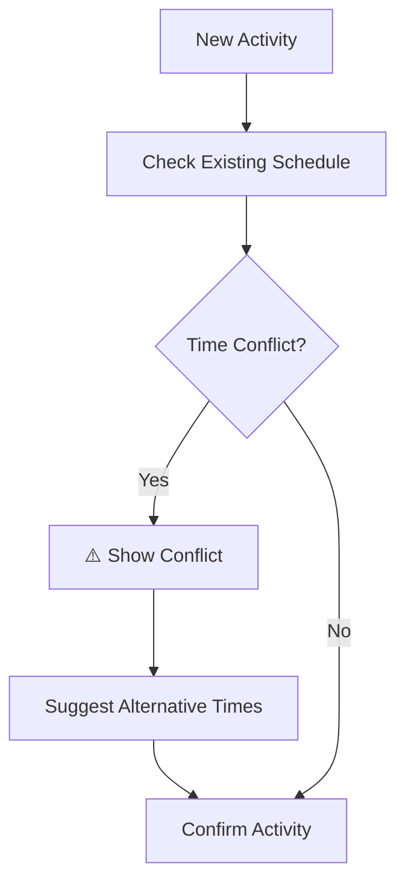

Example:

```text
City Tour
4:00 PM – 6:00 PM

Massage
5:00 PM – 6:00 PM

Result:
SCHEDULE_CONFLICT
```

The system should suggest available alternative slots.

---

# 🔒 Real-Time Inventory Locking

Booking must protect against double reservations.

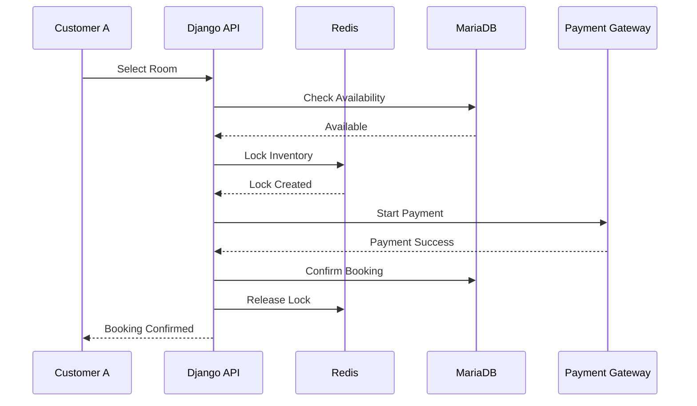

Default temporary lock:

```text
10 minutes
```

The lock duration should be configurable.

---

# 🔐 Concurrency Protection

The system must prevent:

```text
Double Room Booking
Double Table Booking
Double Therapist Booking
Double Vehicle Booking
Tour Overbooking
```

Use:

- Database transactions
- `transaction.atomic()`
- `select_for_update()`
- Unique constraints
- Redis locks
- Final availability verification

---

# 📋 Unified Booking Architecture

```mermaid
classDiagram

    Booking <|-- HotelBooking
    Booking <|-- RestaurantBooking
    Booking <|-- BarBooking
    Booking <|-- TourBooking
    Booking <|-- TransportBooking
    Booking <|-- WellnessBooking
    Booking <|-- PackageBooking

    Booking {
        booking_number
        customer
        booking_type
        status
        start_datetime
        end_datetime
        subtotal
        discount
        tax
        fees
        total
        currency
        payment_status
    }

    HotelBooking {
        room
        check_in
        check_out
    }

    RestaurantBooking {
        table
        guests
        reservation_time
    }

    TourBooking {
        activity
        participants
    }

    TransportBooking {
        vehicle
        pickup
        destination
    }

    WellnessBooking {
        service
        therapist
        appointment_time
    }
```

---

# 🔄 Booking Lifecycle

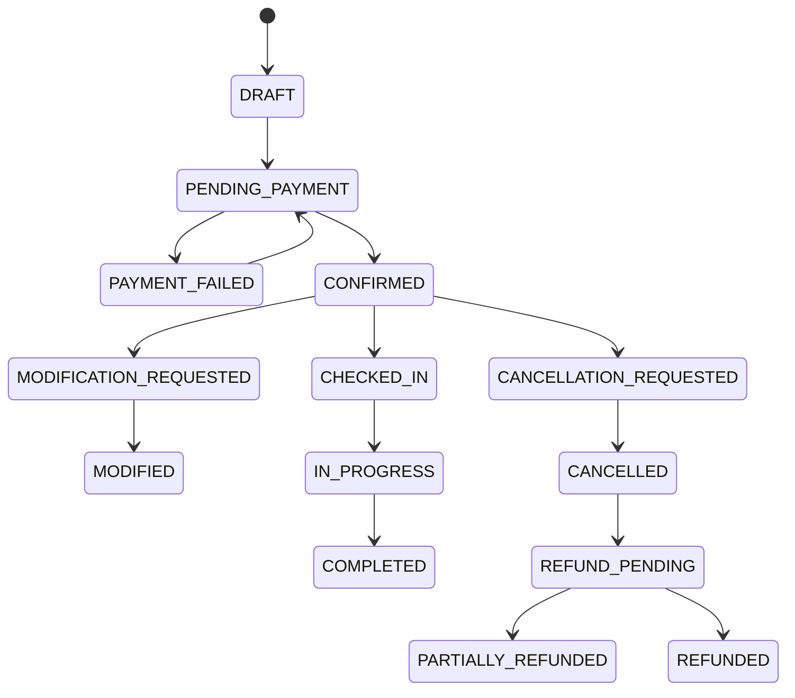

Invalid state transitions must be rejected.

---

# 🔄 Real-Time Rescheduling

Customer flow:

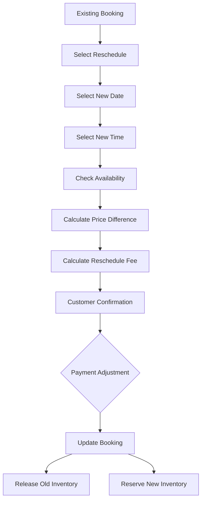

---

# ❌ Cancellation & Refund

Cancellation rules are configurable.

Example:

```text
7+ days     → 100% refund
3–6 days    → 75% refund
1–2 days    → 50% refund
Same day    → Configurable
```

The system calculates:

```text
Original Amount
        ↓
Cancellation Policy
        ↓
Cancellation Fee
        ↓
Non-refundable Amount
        ↓
Refundable Amount
```

---

# 💳 Payment Architecture

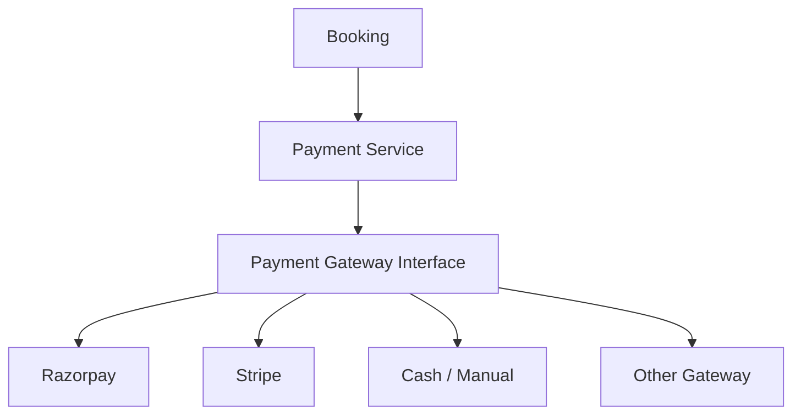

Payment statuses:

```text
INITIATED
PENDING
SUCCESS
FAILED
CANCELLED
REFUND_PENDING
REFUNDED
PARTIALLY_REFUNDED
```

Payment webhooks must be:

- Secure
- Signature validated
- Idempotent
- Transaction-safe

---

# 🧾 Invoice

Invoices should contain:

```text
Hotel Details
Customer Details
Booking Number
Invoice Number
Service Details
Room Details
Dining
Tours
Transport
Wellness
Add-ons
Taxes
Discounts
Payments
Refunds
```

Invoices should be downloadable as PDF.

---

# 👤 Customer Portal

## Customer Navigation

```text
Home
Rooms
Dining
Bar
Tours
Travel
Wellness
Packages
My Trips
Profile
```

---

# 🧳 My Trips

The customer dashboard contains:

```text
Upcoming Trips
Ongoing Trips
Completed Trips
Cancelled Trips
Previous Visits
```

Every booking can display:

```text
Booking Number
Dates
Services
Status
Payment Status
Amount
```

---

# 🔁 Book Again

Completed bookings should have a:

```text
BOOK AGAIN
```

action.

Flow:

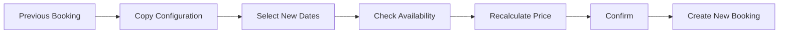

Important:

> Historical prices and inventory must never be blindly copied.

The system must always recalculate current:

- Prices
- Availability
- Taxes
- Discounts
- Package rules

---

# 📜 Customer History

Previous visits should include:

```text
Hotel Stay
Restaurant
Bar
Tours
Activities
Transport
Spa
Massage
Wellness
Packages
```

Each historical record should provide relevant details and a **Book Again** action where applicable.

---

# 🔔 Notification System

Supported channels:

```text
Email
SMS
WhatsApp
In-App
```

Events:

```text
Registration
Booking Created
Payment Successful
Payment Failed
Booking Confirmed
Booking Modified
Booking Rescheduled
Booking Cancelled
Refund Initiated
Refund Completed
Hotel Check-in Reminder
Hotel Check-out Reminder
Tour Reminder
Restaurant Reminder
Spa Reminder
Transport Reminder
```

---

# ⚙️ Celery Background Jobs

Use Celery for:

```text
Email
SMS
WhatsApp
Booking reminders
Refund processing
Invoice generation
Report generation
Expired lock cleanup
Scheduled notifications
```

---

# 📡 Real-Time Communication

Use Django Channels/WebSockets for meaningful real-time events.

Examples:

```text
Room Availability
Restaurant Availability
Tour Capacity
Spa Availability
Booking Status
Payment Status
Admin Booking Updates
```

Use REST APIs for standard CRUD operations.

---

# 📊 Admin Dashboard

Dashboard KPIs:

```text
Today's Revenue
Today's Check-ins
Today's Check-outs
Current Occupancy
Available Rooms
Restaurant Reservations
Tour Bookings
Spa Appointments
Transport Bookings
Pending Payments
Pending Refunds
Today's Cancellations
Upcoming Arrivals
```

---

# 📈 Reports

## Hotel

- Occupancy
- ADR
- Revenue
- Room utilization
- Check-ins
- Check-outs
- Cancellations

## Restaurant

- Revenue
- Orders
- Popular items
- Table utilization

## Tours

- Bookings
- Capacity
- Revenue
- Popular activities

## Wellness

- Appointments
- Revenue
- Therapist utilization
- Popular services

## Overall

- Gross Revenue
- Net Revenue
- Refunds
- Discounts
- Taxes
- Bookings
- Cancellation Rate
- Service Utilization

---

# 🛡️ Security

Implement:

```text
JWT Authentication
Role-Based Authorization
Object-Level Authorization
Input Validation
Rate Limiting
CORS
Secure File Uploads
Webhook Signature Validation
Audit Logging
Environment Secrets
```

Never commit:

```text
Database passwords
JWT secrets
Payment secrets
API keys
Production credentials
```

---

# 🧾 Audit Logging

Important administrative operations should be recorded.

```text
User
Action
Module
Record
Old Value
New Value
IP
Timestamp
```

Examples:

```text
Admin changed room price
Manager changed package
Reception assigned room
Accountant processed refund
Admin cancelled booking
```

---

# 🎨 UI / UX Design

## Customer Portal

### Design Direction

**Luxury Hotel**

Palette:

```text
White
Off-white
Charcoal
Soft Gray
Muted Gold
```

Design principles:

- Generous whitespace
- Elegant typography
- High-quality imagery
- Thin borders
- Subtle shadows
- Premium cards
- Minimal animation
- Clear hierarchy

Avoid:

- Excessive gradients
- Neon colors
- Excessive animation
- Huge rounded containers
- Visual clutter

---

# 🖥️ Admin Portal

### Design Direction

**Modern SaaS**

Palette:

```text
White
Light Gray
Charcoal
Single Accent Color
```

UI components:

```text
Cards
Tables
Tabs
Filters
Drawers
Modals
Badges
Charts
Pagination
Search
```

Keep the interface clean and information-focused.

---

# 🎨 CSS Principles

Use plain CSS or CSS Modules.

Use CSS variables:

```css
:root {
  --color-bg: #ffffff;
  --color-surface: #fafafa;
  --color-text: #222222;
  --color-muted: #777777;
  --color-border: #e7e7e7;
  --color-accent: #b59a5b;

  --radius-sm: 6px;
  --radius-md: 10px;

  --space-sm: 8px;
  --space-md: 16px;
  --space-lg: 24px;
  --space-xl: 40px;
}
```

Keep shadows subtle.

Do not use heavy visual effects.

---

# 📱 Responsive Design

The platform must support:

```text
Desktop
Laptop
Tablet
Mobile
```

Mobile booking should provide:

- Large touch targets
- Sticky booking summary
- Bottom action bar
- Collapsible sections
- Mobile-friendly date/time selectors

Example:

```text
┌────────────────────────────┐
│ Booking Summary             │
│                             │
│ Total: ₹28,450              │
│                             │
│ [       Continue       ]    │
└────────────────────────────┘
```

---

# 🔌 API Architecture

Base URL:

```text
/api/v1/
```

Major endpoints:

```text
/api/v1/auth/
/api/v1/customers/
/api/v1/rooms/
/api/v1/room-types/
/api/v1/restaurants/
/api/v1/bar/
/api/v1/tours/
/api/v1/transport/
/api/v1/wellness/
/api/v1/packages/
/api/v1/bookings/
/api/v1/payments/
/api/v1/notifications/
/api/v1/reports/
```

---

# 📖 API Documentation

Provide:

```text
/api/docs/
/api/schema/
```

Document:

- Authentication
- Rooms
- Bookings
- Packages
- Pricing
- Payments
- Rescheduling
- Cancellation
- Refunds
- Restaurant
- Tours
- Transport
- Wellness
- Notifications

---

# 🗄️ Database Principles

Use a normalized relational schema.

Use:

```text
ForeignKey
OneToOneField
ManyToManyField
UniqueConstraint
CheckConstraint
Indexes
```

Frequently queried fields should be indexed:

```text
booking_number
customer
status
start_datetime
end_datetime
room
room_type
payment_status
```

Use:

```python
select_related()
prefetch_related()
```

to prevent N+1 queries.

---

# 🧮 Core Business Services

The application should contain dedicated services.

```text
AvailabilityService
PricingService
BookingService
RefundService
ItineraryService
NotificationService
PaymentService
InventoryService
```

---

# 🧠 Service Architecture

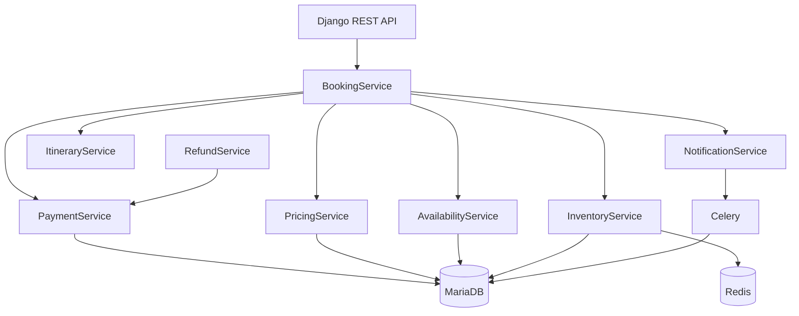

---

# 🔄 Core Booking Flow

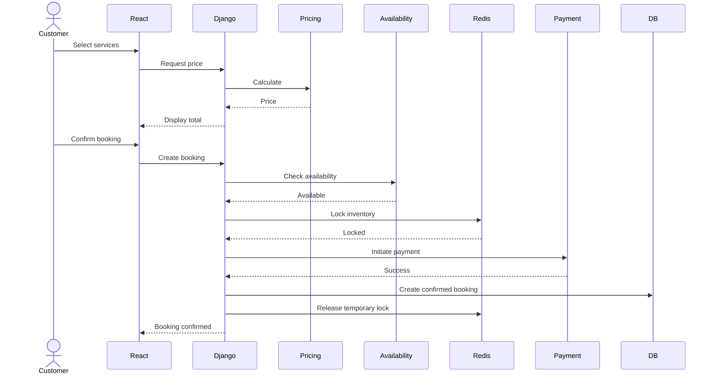

---

# 🧪 Testing Strategy

Test the most important business rules.

## Authentication

- Registration
- Login
- JWT
- Refresh
- Permissions

## Hotel

- Availability
- Booking
- Double booking
- Check-in
- Check-out

## Restaurant

- Table availability
- Reservations
- Orders

## Tours

- Capacity
- Activity booking

## Wellness

- Therapist conflicts
- Appointment booking

## Pricing

- Age pricing
- Group pricing
- Bulk discounts
- Upgrades
- Taxes
- Coupons

## Booking

- Inventory lock
- Payment
- Confirmation
- Modification

## Rescheduling

- Higher price
- Lower price
- Additional payment
- Refund difference
- Availability

## Cancellation

- Policy
- Refund
- Inventory release
- Notifications

## Book Again

- Current availability
- Current pricing
- New booking number
- Original booking remains unchanged

---

# 🧪 Critical Concurrency Test

The system must pass this scenario:

```text
Customer A → Room 101
Customer B → Room 101
```

at approximately the same time.

Expected:

```text
Customer A → SUCCESS
Customer B → ROOM UNAVAILABLE
```

Equivalent tests must be created for:

```text
Restaurant Table
Therapist
Vehicle
Tour Capacity
```

---

# 🧪 Rescheduling Test

```text
Existing Booking
       ↓
New Date
       ↓
Availability
       ↓
Price Calculation
       ↓
Price Higher?
       │
       ├── YES → Additional Payment
       │
       └── NO → Refund Difference
       ↓
Booking Updated
```

---

# 🧪 Cancellation Test

Verify:

```text
Cancellation Policy
        ↓
Cancellation Fee
        ↓
Refund Amount
        ↓
Inventory Release
        ↓
Booking Status
        ↓
Payment Status
        ↓
Notification
```

---

# 🌱 Seed Data

Development environment should contain realistic data.

Minimum:

```text
1 Hotel

10+ Room Types
30+ Rooms

Restaurant
20+ Tables
Menu Categories
Menu Items

Bar
Tables
Menu Items

Destinations
Tours
Activities
Guides

Vehicles
Drivers

Spa Services
Massage Services
Therapists

Packages
Add-ons
Pricing Rules
Coupons

Admin Users
Staff Users
Customer Users
```

---

# 🧪 Development Accounts

Provide development-only accounts for:

```text
Admin
Hotel Manager
Receptionist
Restaurant Manager
Tour Manager
Spa Manager
Accountant
Customer
```

Do not use production credentials.

---

# 📁 Recommended Repository Structure

```text
hotel-management/
│
├── frontend/
│   ├── src/
│   ├── public/
│   ├── package.json
│   └── vite.config.js
│
├── backend/
│   ├── apps/
│   ├── config/
│   ├── common/
│   ├── manage.py
│   ├── requirements.txt
│   └── .env.example
│
├── docs/
│   ├── architecture.md
│   ├── database.md
│   ├── api.md
│   ├── booking-engine.md
│   ├── pricing-engine.md
│   ├── deployment.md
│   └── testing.md
│
├── .gitignore
└── README.md
```

---

# 🚀 Development Roadmap

```mermaid
flowchart LR

    P1["Phase 1\nProject Setup"]
    P2["Phase 2\nAuthentication"]
    P3["Phase 3\nDatabase"]
    P4["Phase 4\nHotel"]
    P5["Phase 5\nRestaurant"]
    P6["Phase 6\nBar"]
    P7["Phase 7\nTours"]
    P8["Phase 8\nTransport"]
    P9["Phase 9\nWellness"]
    P10["Phase 10\nPricing"]
    P11["Phase 11\nPackages"]
    P12["Phase 12\nBooking Wizard"]
    P13["Phase 13\nPayments"]
    P14["Phase 14\nReal-Time"]
    P15["Phase 15\nRescheduling"]
    P16["Phase 16\nCancellation"]
    P17["Phase 17\nItinerary"]
    P18["Phase 18\nCustomer History"]
    P19["Phase 19\nNotifications"]
    P20["Phase 20\nReports"]
    P21["Phase 21\nTesting"]
    P22["Phase 22\nSecurity"]
    P23["Phase 23\nPerformance"]
    P24["Phase 24\nDeployment"]

    P1 --> P2 --> P3 --> P4 --> P5 --> P6 --> P7 --> P8 --> P9
    P9 --> P10 --> P11 --> P12 --> P13 --> P14 --> P15 --> P16
    P16 --> P17 --> P18 --> P19 --> P20 --> P21 --> P22 --> P23 --> P24
```

---

# 📅 Phase Breakdown

| Phase | Module         | Main Deliverable           |
| ----: | -------------- | -------------------------- |
|     1 | Setup          | Next.js + Django + MariaDB |
|     2 | Authentication | JWT + RBAC                 |
|     3 | Database       | Core models                |
|     4 | Hotel          | Rooms + booking            |
|     5 | Restaurant     | Tables + orders            |
|     6 | Bar            | Reservations + orders      |
|     7 | Tours          | Activities                 |
|     8 | Transport      | Vehicles + transfers       |
|     9 | Wellness       | Spa + massage              |
|    10 | Pricing        | Dynamic pricing            |
|    11 | Packages       | Package builder            |
|    12 | Booking        | Unified wizard             |
|    13 | Payments       | Multiple gateways          |
|    14 | Real-Time      | Redis + Channels           |
|    15 | Reschedule     | Live modification          |
|    16 | Cancellation   | Refund engine              |
|    17 | Itinerary      | Timeline + conflicts       |
|    18 | History        | Previous visits            |
|    19 | Notifications  | Email/SMS/WhatsApp         |
|    20 | Reports        | Analytics                  |
|    21 | Testing        | Automated tests            |
|    22 | Security       | Security audit             |
|    23 | Performance    | Optimization               |
|    24 | Deployment     | Production setup           |

---

# 🔧 Environment Configuration

Create:

```text
.env
.env.example
```

Example:

```env
DEBUG=

SECRET_KEY=

DB_NAME=
DB_USER=
DB_PASSWORD=
DB_HOST=
DB_PORT=

REDIS_URL=

RAZORPAY_KEY=
RAZORPAY_SECRET=

STRIPE_KEY=
STRIPE_SECRET=

EMAIL_HOST=
EMAIL_PORT=
EMAIL_USER=
EMAIL_PASSWORD=

WHATSAPP_API_KEY=
SMS_API_KEY=
```

Never commit `.env`.

---

# 🖥️ Local Development

## Backend

```bash
cd backend

python -m venv venv

# macOS/Linux
source venv/bin/activate

# Windows
venv\Scripts\activate

pip install -r requirements.txt

python manage.py migrate

python manage.py createsuperuser

python manage.py runserver
```

---

## Frontend

```bash
cd frontend

npm install

npm run dev
```

---

# 🔗 Development URLs

Typical local URLs:

```text
Frontend:
http://localhost:5173

Django API:
http://localhost:8000

Admin:
http://localhost:8000/admin/

Swagger:
http://localhost:8000/api/docs/

OpenAPI:
http://localhost:8000/api/schema/
```

Adjust ports according to the actual development environment.

---

# 📝 API Response Standard

### Success

```json
{
  "success": true,
  "message": "Booking created successfully",
  "data": {}
}
```

### Error

```json
{
  "success": false,
  "message": "Room is no longer available",
  "errors": {}
}
```

Availability conflicts should normally use:

```text
HTTP 409 Conflict
```

Example:

```json
{
  "success": false,
  "code": "INVENTORY_UNAVAILABLE",
  "message": "The selected room is no longer available."
}
```

---

# 🧠 Important Business Rules

## Rule 1 — Backend pricing is authoritative

Frontend pricing is only for immediate display.

Final checkout must always recalculate pricing on the backend.

---

## Rule 2 — Historical bookings preserve their snapshot

If room price changes tomorrow, yesterday's booking must not change.

Store the relevant:

```text
Service Name
Price
Tax
Discount
Package Configuration
```

at booking time.

---

## Rule 3 — Availability is never trusted from frontend state

Always verify availability on the server.

---

## Rule 4 — Book Again creates a new booking

The old booking must remain unchanged.

---

## Rule 5 — Rescheduling is transactional

Old inventory should only be released when the new reservation is successfully established according to the business rules.

---

## Rule 6 — Cancellation must calculate the refund

Never simply mark a booking as cancelled without applying the configured cancellation policy.

---

## Rule 7 — Payment webhooks must be idempotent

Receiving the same webhook twice must not create duplicate transactions.

---

# 📊 Core System Relationship

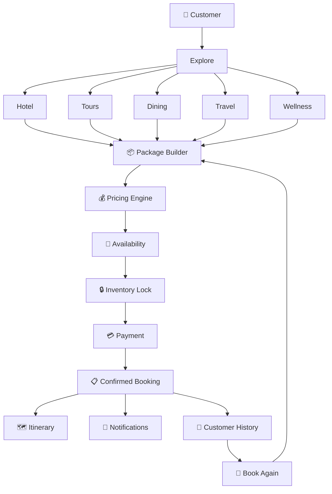

---

# 🎯 Final Acceptance Criteria

The system is complete when:

### Authentication

- [ ] Registration
- [ ] Login
- [ ] JWT
- [ ] Refresh token
- [ ] RBAC
- [ ] Permissions

### Hotel

- [ ] Room types
- [ ] Rooms
- [ ] Availability
- [ ] Booking
- [ ] Check-in
- [ ] Check-out
- [ ] Housekeeping
- [ ] Maintenance

### Restaurant

- [ ] Tables
- [ ] Menu
- [ ] Reservations
- [ ] Orders
- [ ] Kitchen
- [ ] Room service

### Bar

- [ ] Tables
- [ ] Menu
- [ ] Reservations
- [ ] Orders
- [ ] Inventory

### Tours

- [ ] Destinations
- [ ] Tours
- [ ] Activities
- [ ] Guides
- [ ] Capacity

### Transportation

- [ ] Vehicles
- [ ] Drivers
- [ ] Airport transfers
- [ ] Private vehicles
- [ ] Rentals

### Wellness

- [ ] Spa
- [ ] Massage
- [ ] Sauna
- [ ] Steam
- [ ] Therapists
- [ ] Appointments

### Packages

- [ ] Dynamic package builder
- [ ] Add-ons
- [ ] Family plans
- [ ] Group pricing
- [ ] Age pricing
- [ ] Component modifiers

### Booking

- [ ] Unified booking
- [ ] Availability
- [ ] Inventory locking
- [ ] Payment
- [ ] Confirmation
- [ ] Modification

### Rescheduling

- [ ] Availability validation
- [ ] Price difference
- [ ] Additional payment
- [ ] Refund difference
- [ ] Inventory release
- [ ] New inventory reservation

### Cancellation

- [ ] Cancellation policy
- [ ] Cancellation fee
- [ ] Refund calculation
- [ ] Refund processing
- [ ] Inventory release
- [ ] Notifications

### Customer Experience

- [ ] My Trips
- [ ] Previous Visits
- [ ] Previous Activities
- [ ] Book Again
- [ ] Invoices
- [ ] Notifications
- [ ] Reviews

### Itinerary

- [ ] Timeline
- [ ] Conflict detection
- [ ] Alternative time suggestions

### Admin

- [ ] Dashboard
- [ ] Analytics
- [ ] Reports
- [ ] Staff
- [ ] Permissions
- [ ] Audit logs
- [ ] Settings

---

# 🚦 Development Rules for Claude Code / Codex

When using **Claude Code or ChatGPT Codex**, follow this workflow.

## Step 1 — Inspect

Before changing anything:

```text
Inspect repository
Inspect package.json
Inspect requirements.txt
Inspect manage.py
Inspect Django settings
Inspect URLs
Inspect existing apps
Inspect models
Inspect migrations
Inspect React pages
Inspect components
Inspect API services
```

---

## Step 2 — Analyze

Determine:

```text
What exists?
What works?
What is broken?
What is missing?
What can be reused?
What requires refactoring?
```

---

## Step 3 — Plan

Before implementation, provide:

```text
Architecture
Database changes
API changes
Frontend changes
Testing plan
```

---

## Step 4 — Implement

Work phase by phase.

Do not generate hundreds of unrelated files at once.

---

## Step 5 — Test

After every major phase:

```text
Run backend checks
Run migrations
Run tests
Run frontend build
Check API
Check browser flow
```

---

## Step 6 — Report

After each phase report:

```text
Phase
Completed work
Files created
Files modified
Database changes
API changes
Frontend changes
Tests executed
Test results
Remaining issues
Next phase
```

---

# 🚫 Development Anti-Patterns

Do not:

- Put all Django logic inside views
- Put all React state into one global store
- Hard-code pricing
- Hard-code cancellation rules
- Trust frontend pricing
- Trust frontend availability
- Store secrets in Git
- Duplicate business logic
- Create unnecessary Django apps
- Create unnecessary abstractions
- Use mock APIs in production flows
- Ignore database transactions
- Ignore concurrency
- Ignore failed payments
- Ignore webhook duplication
- Delete important historical booking records
- Reuse historical prices during Book Again

---

# 🏁 Definition of Done

The project is considered production-ready only when:

```mermaid
flowchart LR

    Code["Code"]
    Database["Database"]
    API["API"]
    Frontend["Frontend"]
    Booking["Booking Engine"]
    Payment["Payment"]
    Security["Security"]
    Tests["Testing"]
    Performance["Performance"]
    Deployment["Deployment"]

    Code --> Database
    Database --> API
    API --> Frontend
    Frontend --> Booking
    Booking --> Payment
    Payment --> Security
    Security --> Tests
    Tests --> Performance
    Performance --> Deployment
```

All major business flows must work with **real database persistence and real API communication**.

---

# ⭐ Core Product Philosophy

This is not merely a:

> "Hotel Booking Website"

It is a:

> **Complete Hospitality Operations + Customer Experience Platform**

The architecture should therefore prioritize:

```text
                 ┌───────────────────┐
                 │     CUSTOMER      │
                 └─────────┬─────────┘
                           │
                           ▼
                 ┌───────────────────┐
                 │  PACKAGE BUILDER  │
                 └─────────┬─────────┘
                           │
                           ▼
                 ┌───────────────────┐
                 │  PRICING ENGINE   │
                 └─────────┬─────────┘
                           │
                           ▼
                 ┌───────────────────┐
                 │ AVAILABILITY      │
                 │     ENGINE        │
                 └─────────┬─────────┘
                           │
                           ▼
                 ┌───────────────────┐
                 │ INVENTORY LOCK    │
                 └─────────┬─────────┘
                           │
                           ▼
                 ┌───────────────────┐
                 │ PAYMENT ENGINE    │
                 └─────────┬─────────┘
                           │
                           ▼
                 ┌───────────────────┐
                 │ BOOKING ENGINE    │
                 └─────────┬─────────┘
                           │
             ┌─────────────┼─────────────┐
             ▼             ▼             ▼
        ┌─────────┐   ┌──────────┐  ┌────────────┐
        │ITINERARY│   │NOTIFY    │  │CUSTOMER    │
        │ ENGINE   │   │ ENGINE   │  │ HISTORY    │
        └─────────┘   └──────────┘  └──────┬─────┘
                                           │
                                           ▼
                                      ┌───────────┐
                                      │ BOOK AGAIN │
                                      └───────────┘
```

The **Booking Engine, Pricing Engine, Availability Engine, Inventory Locking, Payment Engine and Itinerary Engine** are the central business systems and must be designed as reusable services rather than simple CRUD functionality.

---

## 📄 Documentation

Additional documentation should be maintained under:

```text
docs/
├── architecture.md
├── database.md
├── api.md
├── booking-engine.md
├── pricing-engine.md
├── payment-engine.md
├── itinerary-engine.md
├── deployment.md
└── testing.md
```

---

## 👨‍💻 Development

Built using:

```text
React + Vite
        +
Django REST Framework
        +
MariaDB / MySQL
        +
Redis
        +
Celery
        +
Django Channels
```

---

## 📌 Project Status

> 🚧 **Under Active Development**

Implementation should proceed incrementally from **Phase 1 → Phase 24**, with each phase tested and verified before moving to the next phase.
